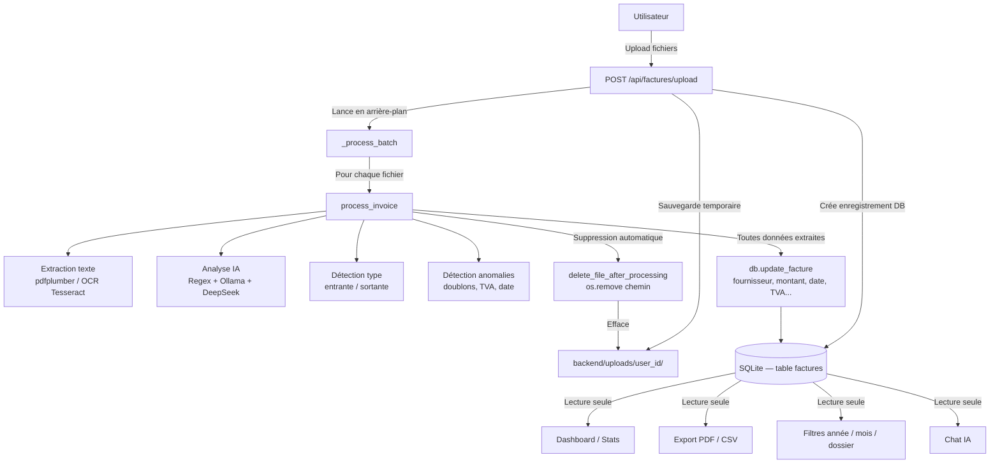
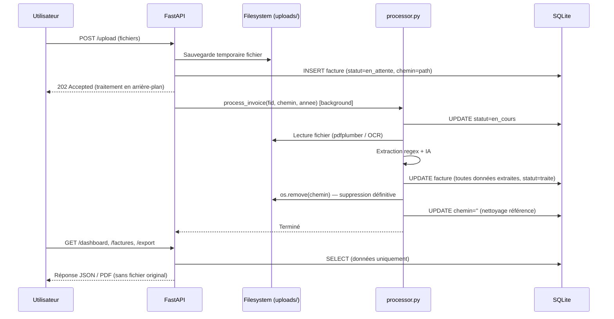

# Document de Design : storage-optimization

## Vue d'ensemble

Optimiser le système de stockage de Finalyse en adoptant une architecture **data-driven** : après traitement complet d'une facture (OCR, extraction, analyse IA), toutes les données utiles sont persistées en base SQLite et le fichier original (PDF, image, Excel) est supprimé automatiquement. L'ensemble de l'application — Dashboard, Statistiques, Exports, Filtres, Chat IA — continue de fonctionner exclusivement à partir des données extraites, sans jamais dépendre des fichiers originaux.

---

## Architecture

### Vue globale — Architecture data-driven



### Flux de traitement détaillé



---

## Schéma de base de données

### Table `factures` — état actuel vs état cible

La table existante contient déjà tous les champs nécessaires. La migration consiste à :
1. S'assurer que `texte_brut` stocke suffisamment de contexte (5 000 caractères, déjà en place)
2. Ajouter un champ `fichier_supprime` pour traçabilité
3. Nettoyer `chemin` après suppression (mettre à `''`)

```sql
-- Migration à appliquer (ajout colonne traçabilité)
ALTER TABLE factures ADD COLUMN fichier_supprime INTEGER DEFAULT 0;

-- Index supplémentaire pour les requêtes de nettoyage
CREATE INDEX IF NOT EXISTS idx_f_supprime ON factures(fichier_supprime);
```

### Structure complète de la table `factures` après migration

```sql
CREATE TABLE IF NOT EXISTS factures (
    -- Identité
    id              INTEGER PRIMARY KEY AUTOINCREMENT,
    user_id         INTEGER NOT NULL,
    dossier_id      INTEGER,

    -- Métadonnées fichier (conservées même après suppression)
    nom_fichier     TEXT DEFAULT '',      -- nom original : "facture_orange_jan.pdf"
    chemin          TEXT DEFAULT '',      -- '' après suppression
    taille          INTEGER DEFAULT 0,   -- taille en octets (conservée)
    fichier_supprime INTEGER DEFAULT 0,  -- 0=présent, 1=supprimé

    -- Période
    annee           INTEGER NOT NULL DEFAULT 2024,
    mois            INTEGER,

    -- Données extraites (source de vérité unique)
    fournisseur     TEXT DEFAULT '',
    date_facture    TEXT DEFAULT '',
    ref_facture     TEXT DEFAULT '',
    montant_ht      REAL DEFAULT 0,
    tva             REAL DEFAULT 0,
    montant_ttc     REAL DEFAULT 0,
    categorie       TEXT DEFAULT 'Autres',
    type_facture    TEXT DEFAULT 'entrante',

    -- Qualité & IA
    statut          TEXT DEFAULT 'en_attente',
    anomalies       TEXT DEFAULT '[]',   -- JSON array
    confiance       REAL DEFAULT 0,
    texte_brut      TEXT DEFAULT '',     -- 5 000 premiers caractères (pour chat IA)
    analyse_ia      TEXT DEFAULT '',

    -- Timestamps
    created_at      TEXT NOT NULL,
    updated_at      TEXT NOT NULL,

    FOREIGN KEY(user_id)    REFERENCES users(id) ON DELETE CASCADE,
    FOREIGN KEY(dossier_id) REFERENCES dossiers(id) ON DELETE SET NULL
);
```

---

## Composants et interfaces

### Composant 1 : `FileCleanupService` (nouveau — `services/file_cleanup.py`)

**Rôle** : Responsabilité unique de la suppression sécurisée des fichiers après traitement.

**Interface** :

```python
def delete_file_after_processing(fid: int, chemin: str) -> bool:
    """
    Supprime le fichier original après traitement réussi.
    Met à jour la DB : chemin='' et fichier_supprime=1.

    Préconditions :
      - fid > 0 et correspond à une facture existante
      - chemin est un chemin absolu valide
      - La facture a statut='traite' (traitement terminé avec succès)

    Postconditions :
      - Le fichier est supprimé du filesystem si il existait
      - factures.chemin = '' dans la DB
      - factures.fichier_supprime = 1 dans la DB
      - Retourne True si suppression réussie, False sinon (fichier déjà absent)

    Invariants :
      - En cas d'erreur filesystem, la DB n'est PAS mise à jour (atomicité)
      - Les données extraites en DB restent intactes quoi qu'il arrive
    """

def cleanup_orphan_files(upload_dir: str) -> dict:
    """
    Nettoyage des fichiers orphelins (présents sur disque mais
    dont la facture est déjà traitée ou supprimée de la DB).

    Retourne : {"deleted": int, "errors": int, "freed_bytes": int}
    """

def get_storage_stats(uid: int) -> dict:
    """
    Statistiques de stockage pour un utilisateur.

    Retourne :
      {
        "nb_fichiers_presents": int,
        "nb_fichiers_supprimes": int,
        "taille_totale_bytes": int,
        "economie_estimee_bytes": int
      }
    """
```

### Composant 2 : `processor.py` — modification du pipeline principal

**Modification de `process_invoice`** : ajout de l'étape de suppression en fin de pipeline.

```python
def process_invoice(fid: int, file_path: str, expected_year: Optional[int] = None) -> None:
    """
    Pipeline complet : extraction → analyse → persistance → suppression fichier.

    Étapes :
      1. Extraction texte (pdfplumber / OCR)
      2. Détection type facture
      3. Extraction regex
      4. Enrichissement IA (DeepSeek / Ollama si nécessaire)
      5. Détection anomalies
      6. db.update_facture() — persistance complète
      7. delete_file_after_processing() — suppression fichier [NOUVEAU]

    Garantie : l'étape 7 n'est exécutée QUE si l'étape 6 a réussi.
    En cas d'erreur à l'étape 6, le fichier est conservé pour diagnostic.
    """
```

### Composant 3 : `database/db.py` — nouvelles fonctions

```python
def mark_file_deleted(fid: int) -> None:
    """
    Marque un fichier comme supprimé dans la DB.
    UPDATE factures SET chemin='', fichier_supprime=1, updated_at=now WHERE id=fid
    """

def get_factures_with_files(uid: int) -> list:
    """
    Retourne les factures dont le fichier est encore présent sur disque.
    SELECT * FROM factures WHERE user_id=? AND fichier_supprime=0 AND chemin!=''
    Utilisé pour le nettoyage manuel ou la migration.
    """
```

---

## Algorithmes clés avec spécifications formelles

### Algorithme principal : `process_invoice` (pipeline modifié)

```pascal
ALGORITHM process_invoice(fid, file_path, expected_year)
INPUT:
  fid          : INTEGER  -- identifiant facture en DB
  file_path    : STRING   -- chemin absolu du fichier temporaire
  expected_year: INTEGER? -- année attendue pour cohérence

PRECONDITIONS:
  fid > 0
  os.path.exists(file_path) = TRUE
  db.get_facture(fid) != NULL
  db.get_facture(fid).statut = 'en_attente'

POSTCONDITIONS:
  db.get_facture(fid).statut IN ('traite', 'erreur')
  IF statut = 'traite' THEN
    db.get_facture(fid).fichier_supprime = 1
    os.path.exists(file_path) = FALSE
    db.get_facture(fid).montant_ttc >= 0
  IF statut = 'erreur' THEN
    os.path.exists(file_path) = TRUE  -- fichier conservé pour diagnostic

BEGIN
  db.set_statut(fid, 'en_cours')

  TRY
    -- Étape 1 : Extraction texte
    texte ← extract_text(file_path)

    -- Étape 2 : Détection type
    detection ← detect_type(texte, nom_fichier)

    -- Étape 3 : Extraction regex
    data ← _extract_regex(texte)
    data.type_facture ← detection.type
    data.texte_brut   ← texte[:5000]

    -- Étape 4 : Enrichissement IA (si nécessaire)
    IF data.montant_ttc = 0 OR data.fournisseur = '' THEN
      ai_result ← _extract_deepseek(texte) OR _extract_ollama_sync(texte)
      IF ai_result != NULL THEN
        data ← _merge(data, ai_result)
      END IF
    END IF

    -- Étape 5 : Anomalies
    data.anomalies ← detect_anomalies(fid, data, expected_year)
    data.statut    ← 'traite'

    -- Étape 6 : Persistance (CRITIQUE — doit réussir avant suppression)
    db.update_facture(fid, data)

    -- Étape 7 : Suppression fichier (SEULEMENT si étape 6 réussie)
    success ← delete_file_after_processing(fid, file_path)
    IF NOT success THEN
      log.warning("Fichier déjà absent ou erreur suppression : %s", file_path)
    END IF

  CATCH Exception AS e
    -- En cas d'erreur : statut erreur, fichier conservé
    db.update_facture(fid, {statut: 'erreur', analyse_ia: str(e)[:200]})
    -- NE PAS supprimer le fichier en cas d'erreur
  END TRY
END
```

**Invariant de boucle** (dans `_process_batch`) :
- À chaque itération, le nombre de fichiers présents sur disque diminue de 1 (ou reste stable en cas d'erreur)
- Les données en DB sont toujours dans un état cohérent (jamais de mise à jour partielle)

### Algorithme : `delete_file_after_processing`

```pascal
ALGORITHM delete_file_after_processing(fid, chemin)
INPUT:
  fid    : INTEGER -- identifiant facture
  chemin : STRING  -- chemin absolu du fichier

PRECONDITIONS:
  fid > 0
  chemin != ''

POSTCONDITIONS:
  os.path.exists(chemin) = FALSE
  db.get_facture(fid).chemin = ''
  db.get_facture(fid).fichier_supprime = 1
  RETURN TRUE si suppression effectuée, FALSE si fichier déjà absent

BEGIN
  file_existed ← os.path.exists(chemin)

  IF file_existed THEN
    TRY
      os.remove(chemin)
      log.info("Fichier supprimé : %s (fid=%d)", chemin, fid)
    CATCH OSError AS e
      log.error("Erreur suppression fichier fid=%d : %s", fid, e)
      RETURN FALSE
    END TRY
  ELSE
    log.warning("Fichier déjà absent : %s (fid=%d)", chemin, fid)
  END IF

  -- Mise à jour DB (même si fichier était déjà absent)
  db.mark_file_deleted(fid)

  RETURN file_existed
END
```

### Algorithme : `cleanup_orphan_files`

```pascal
ALGORITHM cleanup_orphan_files(upload_dir)
INPUT:
  upload_dir : STRING -- chemin du répertoire uploads/

POSTCONDITIONS:
  Tous les fichiers dont la facture est traitée ou inexistante sont supprimés
  RETURN {deleted: int, errors: int, freed_bytes: int}

BEGIN
  deleted      ← 0
  errors       ← 0
  freed_bytes  ← 0

  -- Parcourir tous les fichiers présents sur disque
  FOR each file_path IN glob(upload_dir + "/**/*") DO
    IF NOT os.path.isfile(file_path) THEN CONTINUE END IF

    -- Chercher la facture correspondante en DB
    facture ← db.get_facture_by_chemin(file_path)

    should_delete ← FALSE

    IF facture = NULL THEN
      -- Fichier orphelin (pas de facture en DB)
      should_delete ← TRUE
    ELSE IF facture.statut IN ('traite', 'erreur') THEN
      -- Facture traitée mais fichier non supprimé (migration)
      should_delete ← TRUE
    END IF

    IF should_delete THEN
      TRY
        size ← os.path.getsize(file_path)
        os.remove(file_path)
        IF facture != NULL THEN
          db.mark_file_deleted(facture.id)
        END IF
        deleted     ← deleted + 1
        freed_bytes ← freed_bytes + size
      CATCH Exception AS e
        log.error("Erreur nettoyage : %s — %s", file_path, e)
        errors ← errors + 1
      END TRY
    END IF
  END FOR

  RETURN {deleted: deleted, errors: errors, freed_bytes: freed_bytes}
END
```

---

## Modèles de données

### Réponse API — `GET /api/factures/{fid}`

Après la migration, le champ `chemin` sera vide (`''`) pour les factures traitées. Le frontend ne doit jamais tenter d'afficher ou télécharger le fichier original.

```python
class FactureResponse(BaseModel):
    id: int
    user_id: int
    dossier_id: Optional[int]

    # Métadonnées fichier (conservées)
    nom_fichier: str          # "facture_orange_jan.pdf"
    taille: int               # 245760 (octets)
    fichier_supprime: int     # 0 ou 1

    # Période
    annee: int
    mois: Optional[int]

    # Données extraites (source de vérité)
    fournisseur: str
    date_facture: str
    ref_facture: str
    montant_ht: float
    tva: float
    montant_ttc: float
    categorie: str
    type_facture: str         # "entrante" | "sortante"

    # Qualité
    statut: str
    anomalies: list
    confiance: float
    analyse_ia: str

    # NB : chemin et texte_brut ne sont PAS exposés dans l'API publique
```

### Règles de validation

- `montant_ttc >= 0` : toujours positif (le type_facture indique entrante/sortante)
- `confiance` ∈ [0.0, 1.0]
- `statut` ∈ `{'en_attente', 'en_cours', 'traite', 'erreur'}`
- `fichier_supprime` ∈ `{0, 1}`
- `chemin = ''` si et seulement si `fichier_supprime = 1`

---

## Gestion des erreurs

### Scénario 1 : Erreur d'extraction (OCR échoue, fichier corrompu)

**Condition** : `process_invoice` lève une exception avant `db.update_facture`  
**Réponse** : `statut = 'erreur'`, `analyse_ia` contient le message d'erreur  
**Récupération** : Le fichier est **conservé** sur disque pour permettre un re-traitement manuel  
**Invariant** : `fichier_supprime = 0`, `chemin` pointe toujours vers le fichier

### Scénario 2 : Erreur de suppression fichier (permissions, disque plein)

**Condition** : `os.remove()` lève `OSError` après `db.update_facture` réussi  
**Réponse** : Log d'erreur, `fichier_supprime` reste à 0, données en DB intactes  
**Récupération** : Le job `cleanup_orphan_files` peut être relancé manuellement  
**Invariant** : Les données extraites sont toujours disponibles en DB

### Scénario 3 : Suppression manuelle d'une facture (`DELETE /api/factures/{fid}`)

**Condition** : L'utilisateur supprime une facture depuis l'interface  
**Réponse** : Suppression de l'enregistrement DB + tentative de suppression fichier si encore présent  
**Récupération** : Si le fichier est déjà absent (`fichier_supprime=1`), pas d'erreur  
**Code actuel** : Déjà géré dans `routes/factures.py` — `os.remove(chemin)` avec try/except

### Scénario 4 : Migration des fichiers existants

**Condition** : Des fichiers sont présents dans `uploads/` pour des factures déjà traitées  
**Réponse** : Endpoint `POST /api/admin/cleanup` déclenche `cleanup_orphan_files`  
**Récupération** : Rapport de nettoyage retourné (nb supprimés, octets libérés)

---

## Stratégie de tests

### Tests unitaires

```python
# test_file_cleanup.py

def test_delete_file_after_processing_success(tmp_path):
    """Vérifie que le fichier est supprimé et la DB mise à jour."""
    # Arrange : créer un fichier temporaire et une facture en DB
    f = tmp_path / "test.pdf"
    f.write_bytes(b"PDF content")
    fid = db.create_facture(uid=1, nom="test.pdf", chemin=str(f), taille=11)

    # Act
    result = delete_file_after_processing(fid, str(f))

    # Assert
    assert result == True
    assert not f.exists()
    facture = db.get_facture(fid, uid=1)
    assert facture["chemin"] == ""
    assert facture["fichier_supprime"] == 1


def test_delete_file_already_absent(tmp_path):
    """Fichier déjà absent — pas d'erreur, DB mise à jour quand même."""
    fid = db.create_facture(uid=1, nom="ghost.pdf", chemin="/nonexistent/ghost.pdf", taille=0)
    result = delete_file_after_processing(fid, "/nonexistent/ghost.pdf")
    assert result == False
    facture = db.get_facture(fid, uid=1)
    assert facture["fichier_supprime"] == 1


def test_process_invoice_deletes_file_on_success(tmp_path, mock_db):
    """Après traitement réussi, le fichier doit être supprimé."""
    f = tmp_path / "facture.pdf"
    f.write_bytes(b"%PDF-1.4 test content")
    fid = mock_db.create_facture(uid=1, nom="facture.pdf", chemin=str(f), taille=21)

    process_invoice(fid, str(f), expected_year=2025)

    assert not f.exists()
    facture = mock_db.get_facture(fid, uid=1)
    assert facture["statut"] == "traite"
    assert facture["fichier_supprime"] == 1


def test_process_invoice_keeps_file_on_error(tmp_path, mock_db):
    """En cas d'erreur de traitement, le fichier doit être conservé."""
    f = tmp_path / "corrupt.pdf"
    f.write_bytes(b"not a valid pdf")
    fid = mock_db.create_facture(uid=1, nom="corrupt.pdf", chemin=str(f), taille=15)

    # Simuler une erreur DB lors de update_facture
    with patch("database.db.update_facture", side_effect=Exception("DB error")):
        process_invoice(fid, str(f), expected_year=2025)

    assert f.exists()  # fichier conservé
    facture = mock_db.get_facture(fid, uid=1)
    assert facture["statut"] == "erreur"
    assert facture["fichier_supprime"] == 0
```

### Tests basés sur les propriétés (Property-Based Testing)

**Bibliothèque** : `hypothesis`

```python
from hypothesis import given, strategies as st

@given(
    montant=st.floats(min_value=0, max_value=10_000_000),
    fournisseur=st.text(min_size=1, max_size=60),
    date=st.text(min_size=8, max_size=20),
)
def test_extracted_data_always_persisted_before_deletion(montant, fournisseur, date, tmp_path):
    """
    Propriété : pour tout fichier traité avec succès,
    les données extraites sont en DB AVANT que le fichier soit supprimé.
    """
    # La suppression ne peut jamais précéder la persistance DB
    call_order = []

    original_update = db.update_facture
    original_delete = os.remove

    def tracked_update(fid, data):
        call_order.append("db_update")
        return original_update(fid, data)

    def tracked_delete(path):
        call_order.append("file_delete")
        return original_delete(path)

    with patch("database.db.update_facture", tracked_update), \
         patch("os.remove", tracked_delete):
        # ... setup et appel process_invoice ...
        pass

    db_idx  = call_order.index("db_update")  if "db_update"  in call_order else -1
    del_idx = call_order.index("file_delete") if "file_delete" in call_order else -1

    if del_idx >= 0:
        assert db_idx < del_idx, "La DB doit être mise à jour AVANT la suppression du fichier"


@given(st.integers(min_value=1, max_value=1000))
def test_storage_stats_consistent(nb_factures):
    """
    Propriété : nb_fichiers_presents + nb_fichiers_supprimes = nb_total_factures
    """
    stats = get_storage_stats(uid=1)
    assert stats["nb_fichiers_presents"] + stats["nb_fichiers_supprimes"] == \
           stats["nb_total_factures"]
```

### Tests d'intégration

```python
def test_full_pipeline_no_file_after_processing(tmp_path):
    """
    Test end-to-end : upload → traitement → vérification absence fichier.
    """
    # 1. Simuler un upload
    pdf_content = create_test_pdf("Orange SA", 15000.0, "01/01/2025")
    response = client.post("/api/factures/upload", files={"files": pdf_content}, ...)
    fid = response.json()["factures"][0]["id"]

    # 2. Attendre la fin du traitement
    wait_for_processing(fid, timeout=30)

    # 3. Vérifier que le fichier est supprimé
    facture = client.get(f"/api/factures/{fid}").json()
    assert facture["statut"] == "traite"
    assert facture["fichier_supprime"] == 1
    assert not os.path.exists(facture.get("chemin", "nonexistent"))

    # 4. Vérifier que le dashboard fonctionne toujours
    dashboard = client.get("/api/dashboard").json()
    assert dashboard["totaux"]["nb_traites"] >= 1
```

---

## Considérations de performance

- **Suppression synchrone** : `os.remove()` est une opération O(1) sur le filesystem local — pas d'impact mesurable sur le pipeline
- **Index DB** : L'index `idx_f_supprime` sur `fichier_supprime` permet des requêtes de nettoyage rapides même avec des milliers de factures
- **Nettoyage batch** : `cleanup_orphan_files` doit être exécuté en dehors des heures de pointe (tâche planifiée ou endpoint admin)
- **Économie de stockage** : Un PDF de facture pèse en moyenne 200–500 Ko. Pour 1 000 factures, l'économie est de 200 Mo–500 Mo. Les données SQLite correspondantes occupent < 5 Mo.
- **`texte_brut` limité à 5 000 caractères** : Déjà en place dans `db.update_facture`. Suffisant pour le chat IA, sans stocker le texte complet.

---

## Considérations de sécurité

- **Path traversal** : Valider que `chemin` est bien sous `UPLOAD_DIR` avant toute suppression (`Path(chemin).is_relative_to(UPLOAD_DIR)`)
- **Suppression atomique** : Ne jamais supprimer le fichier avant que `db.update_facture` ait commité avec succès
- **Pas d'exposition du chemin** : Le champ `chemin` ne doit pas être retourné dans les réponses API publiques (déjà absent du schéma Pydantic)
- **Nettoyage des répertoires vides** : Après suppression, vérifier si le répertoire `uploads/{user_id}/` est vide et le supprimer pour éviter l'accumulation de dossiers fantômes
- **Audit trail** : Le champ `fichier_supprime` + `updated_at` fournit une traçabilité minimale sans stocker de logs séparés

---

## Dépendances

| Dépendance | Usage | Déjà présente |
|---|---|---|
| `os` (stdlib) | `os.remove()`, `os.path.exists()` | ✅ |
| `pathlib.Path` | Validation des chemins | ✅ |
| `sqlite3` (via `database/db.py`) | Persistance et mise à jour | ✅ |
| `logging` | Traçabilité des suppressions | ✅ |
| `hypothesis` | Property-based testing | ⚠️ À ajouter dans `requirements.txt` |
| `pytest` | Tests unitaires | ⚠️ À vérifier dans `requirements.txt` |

Aucune nouvelle dépendance externe majeure n'est requise. La fonctionnalité repose entièrement sur les composants existants.
